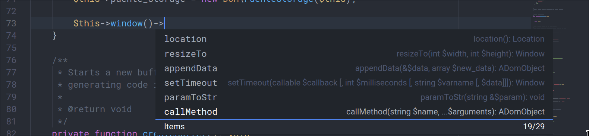
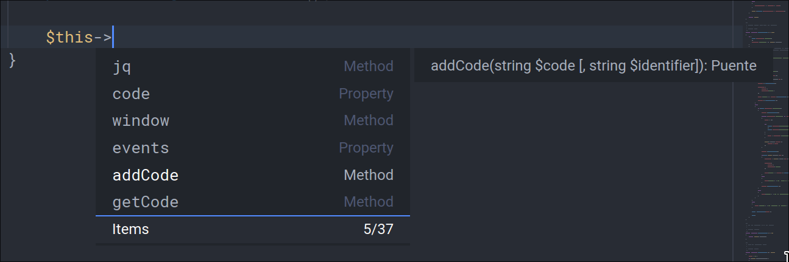
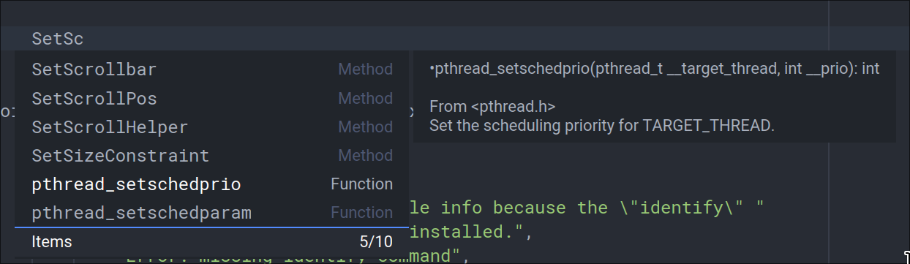
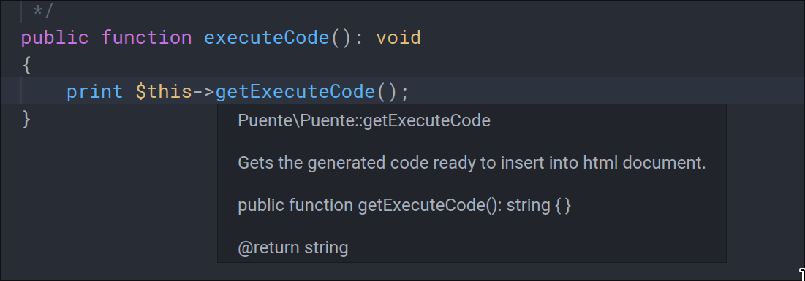
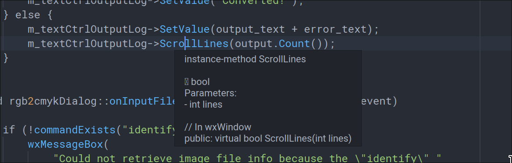
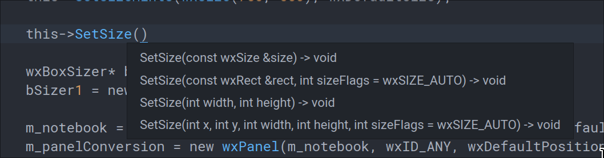
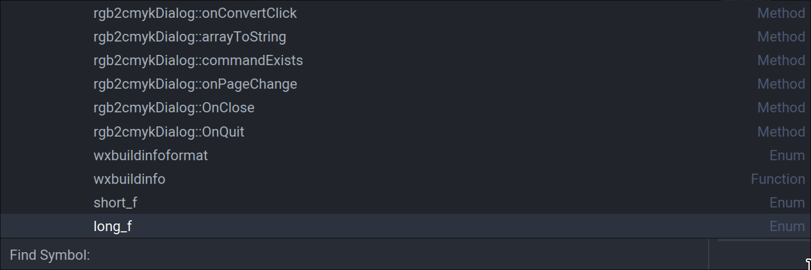
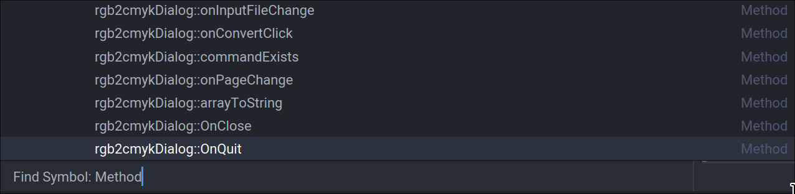
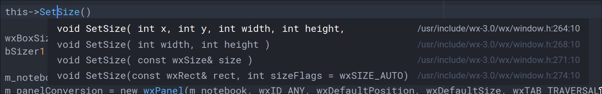
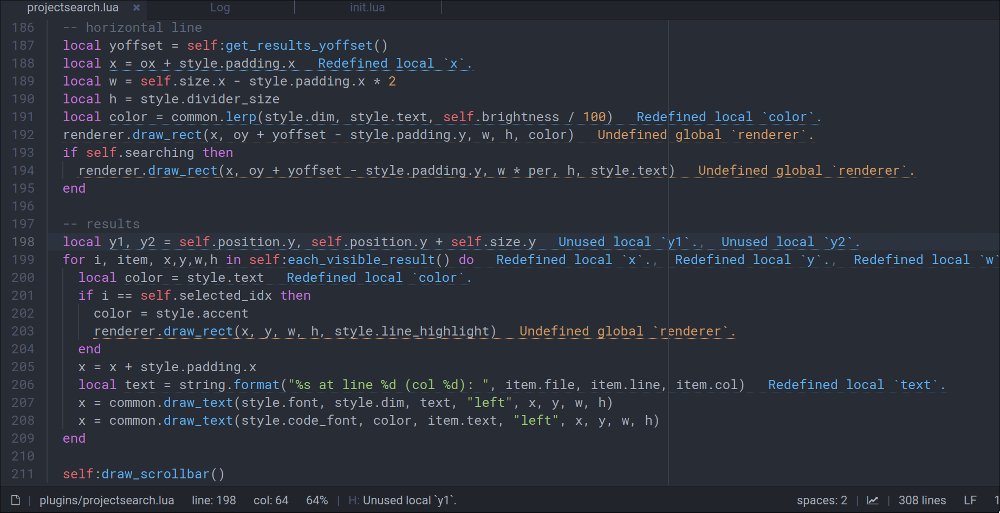

# LSP Plugin for Lite XL editor

Plugin that provides intellisense for Lite XL by leveraging the [LSP protocol]
While still a work in progress it already implements all the most important
features to make your life easier while coding with Lite XL. Using it
requires __Lite XL v2.1+__  (for __Lite XL v2.0.1__ to __Lite XL v2.0.5__
check out the __0.1__ branch). Also [lint+] is optionally used to render
diagnostic messages while you type so make sure to grab that too.

To use, clone this project into the __lsp__ directory in your plugins
folder. Finally you will need the [Widgets] lib so make sure to also drop
it into your lite-xl configs directory. For example:

```sh
cd ~/.config/lite-xl/
git clone https://github.com/lite-xl/lite-xl-lsp plugins/lsp
git clone https://github.com/lite-xl/lite-xl-widgets widget
git clone https://github.com/liquidev/lintplus plugins/lintplus
```

The lite-xl configs directory should have:

* ~/.config/lite-xl/widget/
* ~/.config/lite-xl/plugins/lsp/
* ~/.config/lite-xl/plugins/lintplus/

## Features

Stuff that is currently implemented:

* Code auto completion (**ctrl+space**)
* Function signatures tooltip (**ctrl+shift+space**)
* Current cursor symbol details tooltip on mouse hover or shortcut (**alt+a**)
* Goto definition (**alt+d**)
* Goto implementation (**alt+shift+d**)
* View/jump to current document symbols (**alt+s**)
* Find workspace symbols (**alt+shift+s**)
* View/jump to symbol references (**alt+f**)
* View/jump to document diagnostic messages (**alt+e**)
* Document format (**alt+shift+f**)
* Optional diagnostics rendering while typing with [lint+]
  (**alt+shift+e** to toggle)
* List all documents with diagnostics (**ctrl+alt+e**)

## Setting a LSP Server

The easiest method of setting up a lsp server is by using the __[config.lua]__
file shipped with the lsp plugin which already contains a list of predefined
servers (notice: not all of them have been tested to work). Require this file
on your users **init.lua**, call `setup()` on the desired lsp servers or
overwrite the configuration options of the defined lsp servers if needed
as shown below:

__Examples:__

```lua
local lspconfig = require "plugins.lsp.config"

-- Activate clangd without overwriting any settings for c/c++
-- autocompletion (requires a compile_commands.json file on
-- your project directory usually generated by build tools
-- like cmake or meson)
-- See: https://clangd.llvm.org/installation.html#project-setup
lspconfig.clangd.setup()

-- Activate gopls
lspconfig.gopls.setup()

-- Activate the lua-language-server, set the server command and
-- modify the default settings in order to disable diagnostics.
lspconfig.sumneko_lua.setup {
  command = {
    "/path/to/lua-language-server/bin/Linux/lua-language-server",
    "-E",
    "/path/to/lua-language-server/main.lua"
  },
  settings = {
    Lua = {
      diagnostics = {
        enable = false
      }
    }
  }
}

-- Activate intelephense and pass additional initializationOptions
-- like the license key and storage path.
lspconfig.intelephense.setup {
  init_options = {
    licenceKey = "MYLICENSEKEY",
    storagePath = "/home/myuser/.cache/intelephense"
  }
}
```

If your preferred LSP server is not listed on the config.lua file feel free
to submit a __pull request__ with the addition!

## Manually Configuring a LSP Server

Besides the __[config.lua]__ method, you can fully define an lsp server in
your user init.lua file. You would need to require the lsp plugin and use the
**add_server** function as shown on the following example:

```lua
local lsp = require "plugins.lsp"

lsp.add_server {
  -- Name of server
  name = "intelephense",
  -- Main language
  language = "PHP",
  -- File types that are supported by this server
  file_patterns = { "%.php$" },
  -- LSP command and optional arguments
  command = { "intelephense", "--stdio" },
  -- Optional table of settings to pass into the lsp
  -- Note that also having a settings.json or settings.lua in
  -- your workspace directory with a table of settings is supported.
  settings = {
    intelephense = {
      files = {
        exclude = {
          "**/.git/**"
        }
      }
    }
  },
  -- Optional table of initializationOptions for the LSP
  init_options = {
    storagePath = "/home/myuser/.cache/intelephense"
  },
  -- Set by default to 16 should only be modified if having issues with a server
  requests_per_second = 16,
  -- By default each request is written to the server stdin in chunks of
  -- 10KB, if this gives issues set to false to write everything at once.
  requests_in_chunks = true,
  -- Some servers like bash language server support incremental changes
  -- which are more performant but don't advertise it, set to true to force
  -- incremental changes even if server doesn't advertise them.
  incremental_changes = false,
  -- True to debug the lsp client when developing it
  verbose = false
}
```

## LSP Plugin Settings

Configuration options that can be used to control the plugin behaviour:

```lua
---Show a symbol hover information when mouse cursor is on top.
---@type boolean
config.plugins.lsp.mouse_hover = true,

---The amount of time in milliseconds before showing the tooltip.
---@type integer
config.plugins.lsp.mouse_hover_delay = 300,

---Show diagnostic messages
---@type boolean
config.plugins.lsp.show_diagnostics = true

---Stop servers that aren't needed by any of the open files
---@type boolean
config.plugins.lsp.stop_unneeded_servers = true

---Set to a file path to log all json
---@type string
config.plugins.lsp.log_file = ""

---Setting to true prettyfies json for more readability on the log
---but this setting will impact performance so only enable it when
---in need of easy to read json output when developing the plugin.
---@type boolean
config.plugins.lsp.prettify_json = false

---Send a server stderr output to lite log
---@type boolean
config.plugins.lsp.log_server_stderr = false

---Force verbosity off even if a server is configured with verbosity on
---@type boolean
config.plugins.lsp.force_verbosity_off = false

---Yield when reading from LSP which may give you better UI responsiveness
---when receiving large responses, but will affect LSP performance.
---@type boolean
config.plugins.lsp.more_yielding = false
```

## TODO

- [ ] Properly handle multiple opened project directories
- [ ] Handle window/showMessage, window/showMessageRequest,
  $/progress, telemetry/event
- [x] Be able to search workspace symbols 'workspace/symbol'
- [ ] Completion preselectSupport (needs autocomplete plugin change)
- [ ] Add symbol renaming support 'textDocument/rename'
- [ ] Add Snippets support (this will need a whole standalone plugin).
- [x] Fix issues when parsing stdout from some lsp servers (really fixed?).
- [x] More improvements to autocomplete.lua plugin
  - [x] Detect view edges and render to the most visible side
  - [x] Description box, detect view width and expand accordingly
  - [ ] Support for pre-selected item
  - [ ] Be able to use a custom sorting field.
- [x] Add hover support for function arguments
  - [x] Add custom tooltip that accents active parameter and signature
- [x] Figure out how to get an autocompletion item full documentation with
'completionItem/resolve' or any other in order to better populate
the new autocomplete item description
- [x] (we kill it) Detect if lsp server hangs and restart it (eg: clangd)
- [x] Exit LSP server if no open document needs it.
- [x] Add hover support for symbols
- [x] Generate list of current document symbols for easy document navigation
- [x] Goto definition
  - [x] Display select box when more than one result
- [x] Show diagnostics on active document similar to the linter plugin.
- [x] Send incremental changes on textDocument/didChange notification
  since sending the whole document content on big files is slow and bad.


## Screenshots

Some images to easily visualize the progress :)

### Completion








### Symbol hover




### Function signatures


### Document symbols



### Goto definition


### Diagnostics rendering using Lint+



[LSP protocol]: https://microsoft.github.io/language-server-protocol/specifications/specification-current/
[lint+]:        https://github.com/liquidev/lintplus
[Widgets]:      https://github.com/lite-xl/lite-xl-widgets
[config.lua]:   config.lua
